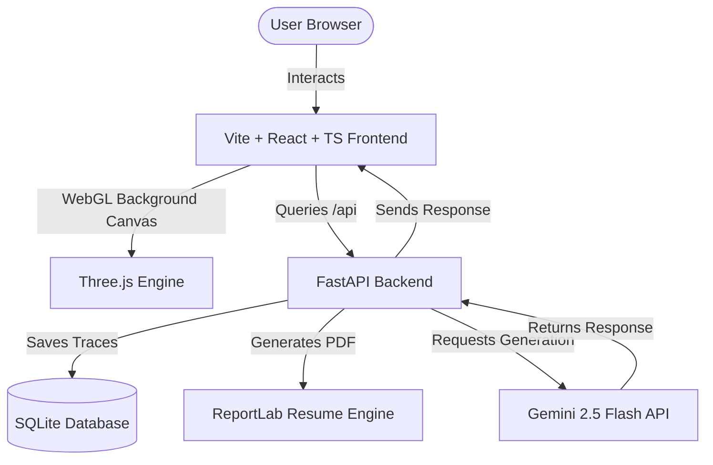

# 🌌 The Multi-Dimensional Universe of Hemanth

A premium, interactive, scroll-driven portfolio application that spans across multiple dimensions of professional capabilities, personal memories, and emotional journeys.

**🔗 Live: [portfolio-r2vv.onrender.com](https://portfolio-r2vv.onrender.com/)**

<div align="center">

[](https://vitejs.dev/)
[](https://reactjs.org/)
[](https://www.typescriptlang.org/)
[](https://threejs.org/)
[](https://fastapi.tiangolo.com/)
[](https://www.docker.com/)
[](https://deepmind.google/technologies/gemini/)

[](https://github.com/hemanthnagasai/Portfolio/actions/workflows/ci.yml)

</div>

---

## 🌌 The Four Dimensions

Explore Hemanth's life and work through four unique visual dimensions:

| Dimension | Aesthetic | Core Features | 3D WebGL Background |
| :--- | :--- | :--- | :--- |
| **🌀 Gateway** | Futuristic Portal | Locked paths that unlock as you explore; cinematic typewriter intro. | Interactive Starfield Vortex |
| **💻 Professional** | Cybernetic HUD | 3D film-reel timeline, interactive projects, education tree, skills. | Data Sky Highway |
| **🍃 Personal** | Scrapbook Journal | Real Polaroid frames, glassmorphic panels, value vertical spine. | Warm Stepping Stones & Fireflies |
| **🕯️ Emotional** | Candlelight Poetry | Poetic letters, signature, moderated message board ("Leave a Trace"). | Constellation Spiral + Flashlight |

A dedicated **Recruiter view** sits outside the four dimensions: a clean, fast, conversational summary of Hemanth's background with an AI chatbot (grounded in his real portfolio data), resume download, and direct contact links.

---

## 🛠️ Architecture & Flow



---

## 🔒 Security & Moderation

This application includes robust security and content moderation features to prevent abuse, resource exhaustion, and spam:

- **AI-Driven Moderation:** Guestbook trace submissions are automatically validated by the Gemini API (`gemini-2.5-flash`) with a fast-path local profanity filter fallback to reject inappropriate content instantly.
- **Rate Limiting:** Protects AI generation quotas and server capacity using an IP-based sliding window rate limiter on key interaction endpoints.
- **Database Row Capping:** Automatically auto-prunes database tables during write operations to prevent disk space exhaustion from continuous spam.
- **Payload Constraints:** Enforces strict Pydantic length and validation constraints on client-supplied data inputs.
- **CORS Hardening:** Cross-origin requests are restricted to an explicit allowlist (configurable via `CORS_ORIGINS`), not left open to any origin.
- **Secure Admin Deletion:** A protected `DELETE /api/traces/{word}` endpoint is available for manual moderation, secured by an `ADMIN_TOKEN` header check, with deletions logged for accountability.

---

## ⚡ Performance & Accessibility

- **Adaptive rendering:** the WebGL scenes drop shadows/antialiasing and cap pixel ratio on lower-power and touch devices, instead of forcing the same render cost on every visitor.
- **Graceful WebGL fallback:** browsers or devices without WebGL support get a static themed background instead of a broken or blank page.
- **Reduced motion:** all animations (page transitions, cursor effects, 3D camera drift) respect the OS-level `prefers-reduced-motion` setting.
- **Code-split routes:** each dimension loads its own JS chunk on demand rather than bundling the whole site upfront.
- **Error boundary:** an unexpected render error shows a recoverable message instead of a blank screen.

---

## ⚙️ Setup & Local Development

### 📋 Prerequisites
- **Node.js** (v18+)
- **Python** (v3.11+)
- **Gemini API Key** (Required for the interactive Recruiter chatbot)

---

### 1️⃣ Environment Configuration

Create a local environment configuration using the provided examples:

* **Backend**: Create a `backend/.env` file:
  ```env
  DB_NAME=portfolio
  GEMINI_API_KEY=your_gemini_api_key_here
  ADMIN_TOKEN=your_admin_token_here
  ```
* **Frontend**: Create a `frontend/.env` file:
  ```env
  PORT=5000
  HOST=0.0.0.0
  REACT_APP_BACKEND_URL=
  ```

---

### 2️⃣ Backend Server Installation (FastAPI)

From the `backend/` directory:

1. **Initialize and Activate Virtual Environment**:
   ```bash
   python -m venv .venv
   
   # Windows PowerShell
   .\.venv\Scripts\Activate.ps1
   
   # macOS / Linux
   source .venv/bin/activate
   ```
2. **Install Dependencies**:
   ```bash
   pip install -r requirements.txt
   ```
3. **Launch Server**:
   ```bash
   python -m uvicorn app.main:app --host localhost --port 8000 --reload
   ```

> [!NOTE]
> The local API Documentation is available at `http://localhost:8000/docs`.

---

### 3️⃣ Frontend Development Setup (Vite + React)

From the `frontend/` directory:

1. **Install Dependencies**:
   ```bash
   npm install
   ```
2. **Launch Dev Server**:
   ```bash
   npm run start
   ```

> [!TIP]
> The frontend will load at `http://localhost:5000/`. Vite will automatically proxy API requests to port `8000` locally.

---

## 🐳 Docker Deployment (Production)

You can run the entire application (serving the built frontend through FastAPI) from a single container:

1. **Build Image**:
   ```bash
   docker build -t life-portfolio .
   ```
2. **Launch Container**:
   ```bash
   docker run -d -p 8000:8000 -e DB_NAME="portfolio" -e GEMINI_API_KEY="your_api_key" -e ADMIN_TOKEN="your_admin_token" life-portfolio
   ```

Open `http://localhost:8000` to view the live app.

---

## 🧪 Running Tests

The backend test suite mocks all external calls (Gemini, etc.), so it runs fully offline and deterministically — no API key or quota needed. It also runs automatically on every push/PR via GitHub Actions (see the CI badge above), alongside a frontend typecheck and build.

To run it locally, navigate to the `backend/` directory and execute:

```bash
cd backend

# Windows PowerShell:
.\.venv\Scripts\pytest

# macOS / Linux:
source .venv/bin/activate
pytest
```
